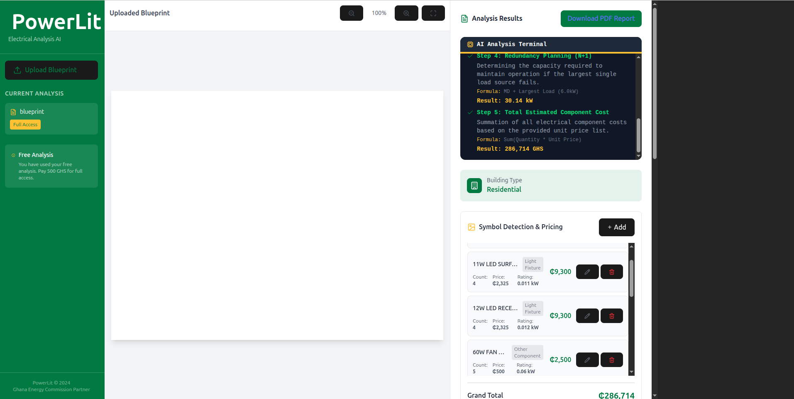

# PowerLit

An AI-powered electrical blueprint analysis platform for electrical companies in Accra, Ghana. Upload electrical blueprints and legends to automatically generate load calculations, component counts, and GS1009 compliance reports.



## Features

- **AI-Powered Analysis**: Uses Google Gemini to analyze electrical blueprints and legends
- **Dual Upload Mode**: Upload separate legend and floor plan files, or a single combined file
- **Real-time Calculations**: Get total connected load, maximum demand, and diversity factors
- **GS1009 Compliance**: Automatic compliance checking with Ghana Energy Commission standards
- **PDF Export**: Generate professional technical reports
- **Payment Integration**: Paystack integration for paid analyses

## Tech Stack

- **Frontend**: React 18 + TypeScript + Vite
- **Styling**: Tailwind CSS 4
- **AI**: Google Gemini 1.5 Pro API
- **State Management**: Zustand
- **PDF Generation**: @react-pdf/renderer
- **Payment**: Paystack Inline
- **Icons**: Lucide React

## Prerequisites

- Node.js 18+ (check with `node --version`)
- npm or yarn
- Google Gemini API key ([get one here](https://ai.google.dev/))
- Paystack account (for payment functionality)

## Quick Start

### 1. Clone and Install

```bash
git clone <repository-url>
cd powerlit
npm install
```

### 2. Environment Setup

Create a `.env` file in the root directory:

```env
VITE_GEMINI_API_KEY=your_gemini_api_key_here
VITE_PAYSTACK_PUBLIC_KEY=your_paystack_public_key_here
```

> **Note**: If you don't have API keys, the app will run in **demo mode** with mock data.

### 3. Run Development Server

```bash
npm run dev
```

The app will be available at `http://localhost:5173`

### 4. Build for Production

```bash
npm run build
```

Output will be in the `dist/` folder.

## Available Scripts

| Command | Description |
|---------|-------------|
| `npm run dev` | Start development server with hot reload |
| `npm run build` | Build for production |
| `npm run preview` | Preview production build locally |
| `npm run lint` | Run ESLint to check code quality |

## Project Structure

```
powerlit/
├── src/
│   ├── components/          # React components
│   │   ├── DocumentViewer/  # Blueprint display
│   │   ├── FileUpload/      # File upload components
│   │   ├── Layout/          # Sidebar and layout
│   │   ├── PaymentModal/    # Payment integration
│   │   ├── PaywallOverlay/  # Paywall UI
│   │   ├── ResultsPanel/    # Analysis results display
│   │   └── ThinkingTerminal/# Analysis progress UI
│   ├── services/            # API and external services
│   │   ├── gemini.ts        # Google Gemini integration
│   │   └── paystack.ts      # Paystack payment service
│   ├── stores/              # Zustand state management
│   │   └── analysisStore.ts # Analysis state
│   ├── types/               # TypeScript type definitions
│   ├── utils/               # Utility functions
│   ├── App.tsx              # Main application
│   └── main.tsx             # Entry point
├── public/                  # Static assets
├── dist/                    # Build output
├── package.json
├── tsconfig.json           # TypeScript config
├── vite.config.ts          # Vite configuration
└── tailwind.config.ts      # Tailwind CSS config
```

## Making Changes as a Developer

### Component Development

Components are in `src/components/`. Each component has its own folder:

```
src/components/ComponentName/
├── ComponentName.tsx       # Main component
└── (other files)           # Styles, tests, etc.
```

To create a new component:

1. Create a new folder in `src/components/`
2. Add your `.tsx` file
3. Export from the file
4. Import and use in `App.tsx` or other components

### Styling

We use **Tailwind CSS**. Styles are applied via utility classes:

```tsx
// Example
<div className="bg-[#007A41] text-white p-4 rounded-lg">
  Content here
</div>
```

**Brand Colors:**
- Primary (Green): `#007A41`
- Accent (Yellow): `#FFC132`
- Background: `#FFFFFF`
- Text: `#1F2937` (gray-800)

### State Management

Global state is managed with **Zustand** in `src/stores/analysisStore.ts`:

```typescript
import { useAnalysisStore } from './stores/analysisStore'

function MyComponent() {
  const { currentAnalysis, setAnalysis } = useAnalysisStore()
  // Use state here
}
```

### Adding API Calls

Service functions are in `src/services/`:

```typescript
// src/services/myService.ts
export async function myApiCall(data: any) {
  const response = await fetch('/api/endpoint', {
    method: 'POST',
    body: JSON.stringify(data)
  })
  return response.json()
}
```

### Environment Variables

All environment variables must be prefixed with `VITE_`:

```env
VITE_MY_VARIABLE=value
```

Access in code:

```typescript
const value = import.meta.env.VITE_MY_VARIABLE
```

## Common Tasks

### Update Dependencies

```bash
npm update
```

### Check for Vulnerabilities

```bash
npm audit
npm audit fix
```

### Run Type Checking

```bash
npx tsc --noEmit
```

## Troubleshooting

### Port Already in Use

If port 5173 is busy, Vite will automatically use the next available port (5174, etc.).

### API Key Not Working

1. Check `.env` file exists in project root
2. Verify variable names start with `VITE_`
3. Restart the dev server after changes
4. Check browser console for errors

### Build Errors

1. Run `npm install` to ensure dependencies are up to date
2. Run `npm run lint` to check for code issues
3. Run `npx tsc --noEmit` to check TypeScript errors

## Deployment

### Vercel (Recommended)

1. Push code to GitHub
2. Connect repo to [Vercel](https://vercel.com)
3. Add environment variables in Vercel dashboard
4. Deploy!

### Manual Deployment

Build the project:

```bash
npm run build
```

Upload the `dist/` folder to your hosting provider.

## Contributing

1. Create a new branch: `git checkout -b feature/my-feature`
2. Make your changes
3. Run linting: `npm run lint`
4. Commit: `git commit -m "Add my feature"`
5. Push: `git push origin feature/my-feature`
6. Create a Pull Request

## License

MIT License - feel free to use this project for your own purposes.

## Support

For issues or questions, please open an issue on GitHub.
